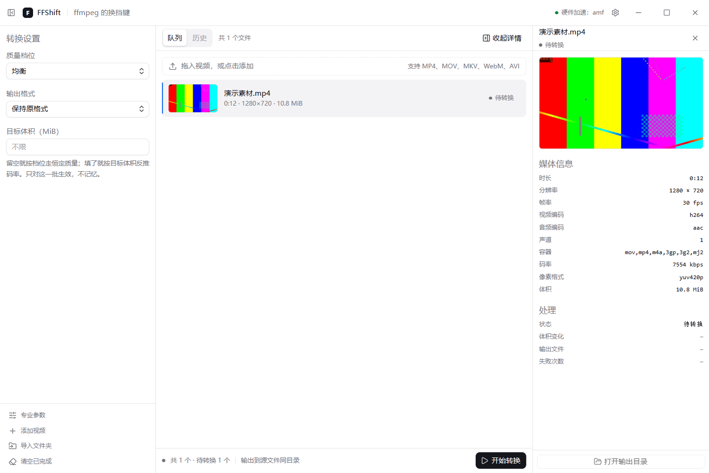
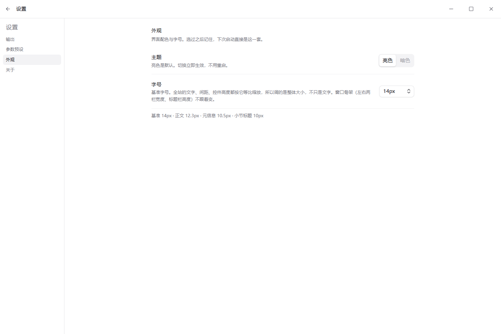

# FFShift

ffmpeg 的换挡键：不用懂参数，也能转好视频。

Windows 优先的桌面视频格式转换器。界面用 Electron + React + TypeScript + Tailwind v4 + Base UI，转换调用 ffmpeg 命令行，视频与密钥都留在本机。

## 界面

主界面只放"这次要转成什么"——档位、输出格式、目标体积：


暗色主题：



设置一次长期有效的偏好（默认输出目录、参数预设、主题、引擎信息）在设置页里，顶栏右上角齿轮进入：



界面语言内化自 [EnsoCode](https://github.com/J3n5en/EnsoCode)（MIT）：
同一套 OKLCH 语义令牌、同一套组件配方。两面板之间只有 1px 边框，颜色只表达状态与那一个反白主按钮。
规则与逐条来源见 `docs/design-system.md`。

截图由 `FFSHIFT_SMOKE=shot` 自动生成：加载窗口、导入一个真实素材、等探测与缩略图落地后再拍，
跑在临时 profile 上（不受本机设置影响），所以图和当前代码永远一致。

## 现在到什么程度

功能已经完整可用：

- **导入探测**：时长、分辨率、编码、体积，随机抽出缩略图
- **格式转换**：视频出 MP4 / MKV / MOV / WebM，动图出 GIF，音频出 MP3 / M4A / Opus / FLAC / WAV，或者保持原格式
- **质量三档**：更清晰 / 均衡 / 更小；指定目标体积也行
- **过程可见**：百分比、剩余时间、速度，随时取消并清理半成品
- **出错说人话**：磁盘满、目录不可写、格式不兼容、文件损坏各有对应说明
- **专业参数**：20 项可调参数 + 预设管理，给懂行的人一个入口
- 设置记忆、亮暗主题、10–24px 可调界面字号、Windows 安装包

逐条状态见 `docs/testing.md` 的冒烟清单（未实测的条目如实标注）。

## 环境要求

| 场景 | 需要什么 |
| --- | --- |
| 装好的应用（安装包 / 免安装版） | **什么都不用装**：ffmpeg 与 ffprobe 已随包分发 |
| 从源码开发 | Node.js ≥ 20（实测 v22.23.2）、git 2.40+；`npm run prepare-ffmpeg` 会把系统里的 ffmpeg 复制进 `resources/ffmpeg/` 供打包使用（二进制不进仓库） |

## 上手

```bash
npm run hooks:install    # 装 git 钩子，新克隆仓库后运行一次
npm run hooks:verify     # 17 条钩子用例：拦截与放行都验一遍
npm run docs:sync        # 手动补跑一次文档沉淀
npm run docs:digest      # 查看 AI 沉淀草稿
npm run lint:commit      # 校验最近一次提交信息
```

## 开发流程

`main` 受保护，只能由功能分支经 PR 合并进来。分支名格式 `<前缀>/<模块>-<动作>`，例如 `feat/media-probe`。提交信息格式 `<area>: <祈使句>`，正文写清为什么改。

完整规则在 `docs/git-workflow.md`；钩子做什么、AI 在哪些环节参与，见 `docs/automation.md`。

## 文档

| 文件 | 内容 |
| --- | --- |
| `docs/architecture.md` | 方案与选型：竞品分析、技术栈对比、模块设计 |
| `docs/design-system.md` | 设计令牌与组件规范（颜色的来源与偏离都在这里） |
| `docs/ui-spec.md` | 界面结构与交互契约（含 `data-slot` 测试锚点） |
| `docs/decisions.md` | 决策记录（ADR）：每条决策的备选、理由、代价、反馈 |
| `docs/git-workflow.md` | 分支模型、提交规范、仓库红线、版本与发布 |
| `docs/automation.md` | 钩子清单、文档沉淀范围、AI 使用边界 |
| `docs/testing.md` | 测试清单与执行记录 |
| `docs/writing-style.md` | 文案契约：禁词、句式、术语统一 |
| `docs/ai-session-log.md` | AI 协作会话记录 + 提交流水（自动追加） |
| `docs/project-status.md` | 项目状态页（自动生成，勿手改） |

## 规格

需求与规格放在 `openspec/`：`specs/` 记录系统当前必须满足的行为，`changes/` 存放尚未落地的提案。开发一个模块前先立提案，完成后归档。
