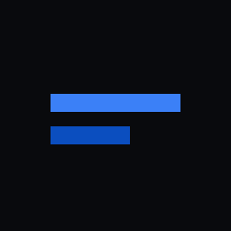
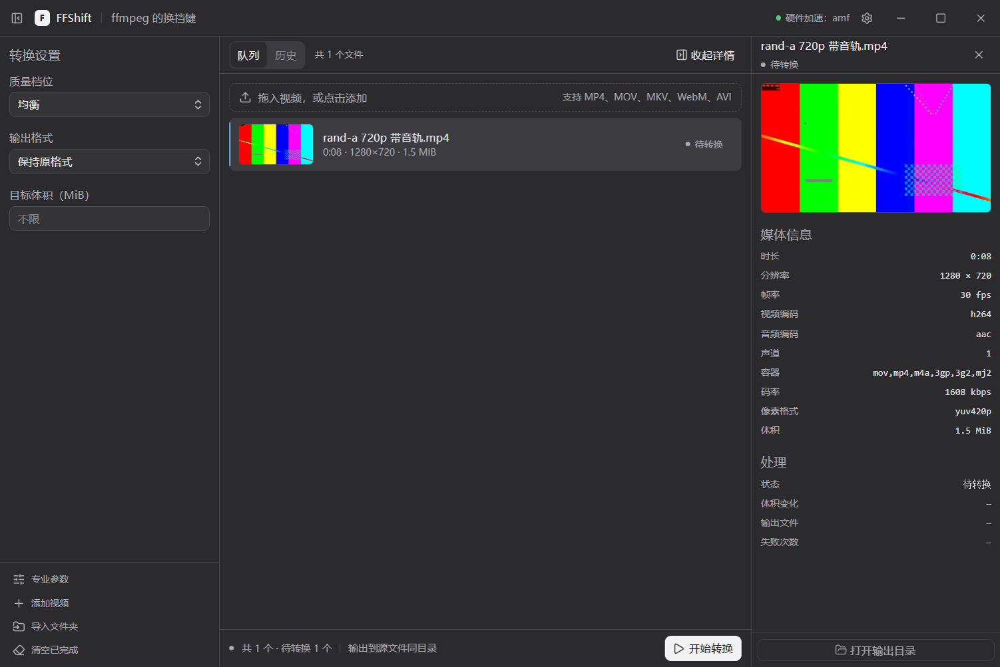
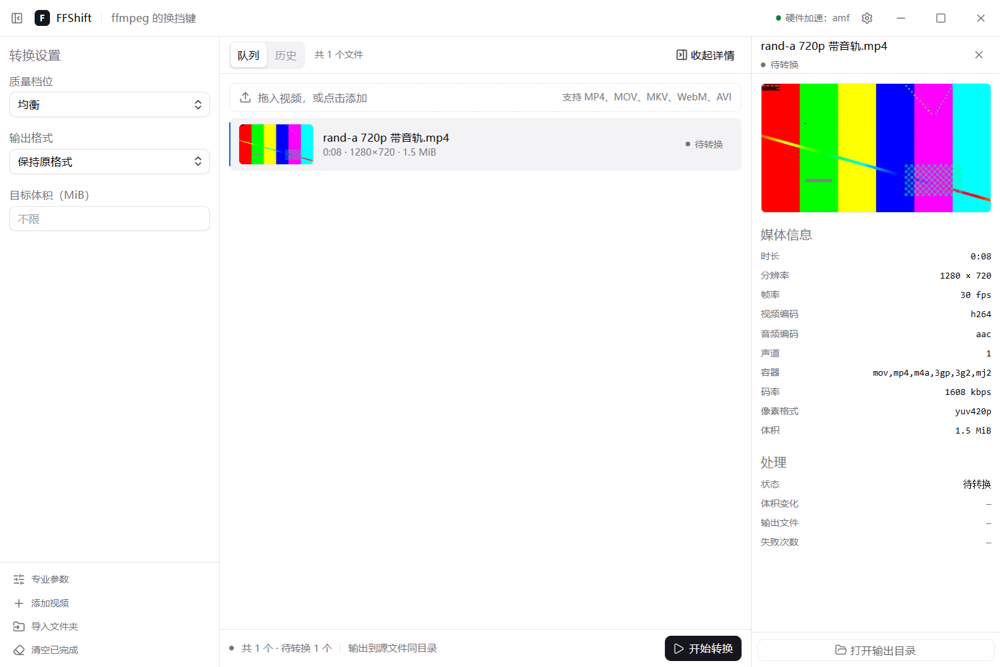
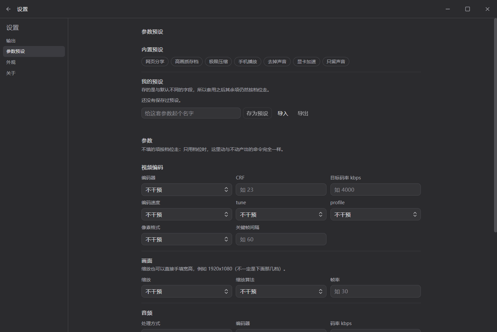

<div align="center">



# FFShift

**ffmpeg 的换挡键。不用懂参数，也能转好视频。**

把视频拖进来，选一个档位，点开始——就这么简单。

[](https://github.com/Albert-PZY/ffshift/releases)
[](LICENSE)
[](https://github.com/Albert-PZY/ffshift/releases)
[](docs/testing.md)

</div>

---

默认浅黑主题、15px 字号。把文件拖进来，剩下的交给 FFShift：


## 它解决什么

Windows 上转格式，要么装一个全家桶，要么打开命令行背参数。FFShift 两个都不用：
它把 ffmpeg 最常用的几组参数压成三档——**更清晰、均衡、更小**——你只需要知道视频拿去干什么，
剩下的交给它。懂行的人也能打开「专业参数」逐项调，两条路都通。

## 它能做什么

| 能力 | 说明 |
| --- | --- |
| 三档预设 | 更清晰 / 均衡 / 更小；或者填一个目标体积，由它反推码率 |
| 格式 | MP4 / MKV / MOV / WebM / GIF，音频 MP3 / M4A / Opus / FLAC / WAV，或保持原格式 |
| 批量 | 拖一堆进去排队，一次转一个，转完自动下一个 |
| 过程可见 | 百分比、剩余时间、速度，随时取消，半成品自动清理 |
| 出错说人话 | 磁盘满、目录不可写、格式不兼容、文件损坏，各有对应的中文说明 |
| 专业参数 | CRF、编码器、GOP、profile、像素格式等 20 项，另带预设保存 / 导入 / 导出 |

## 三套主题

浅黑是默认——底色是中性深灰而不是近黑，文字不用纯白，长时间看不累。
亮色与暗色都在设置里，一行切换。

| 浅黑（默认） | 亮色 | 暗色 |
| --- | --- | --- |
|  |  |  |

## 设置页

默认输出目录、参数预设、字号（10–24px）、引擎信息，都在顶栏齿轮进的设置页里：

| 设置页 | 参数预设 |
| --- | --- |
|  |  |

## 下载与安装

到 [Releases](https://github.com/Albert-PZY/ffshift/releases) 下载：

| 文件 | 适合 |
| --- | --- |
| `FFShift-x.y.z-setup.exe` | 想要开始菜单快捷方式、开机可用——常规安装 |
| `FFShift-x.y.z-portable.exe` | 想直接双击、不写注册表——免安装版 |

两个版本都内置 ffmpeg / ffprobe，**下载完不用再装任何东西**。

<details>
<summary><strong>没有代码签名证书，Windows 会弹 SmartScreen 提示</strong></summary>

FFShift 目前没有购买代码签名证书（个人项目，证书一年几百美元）。
第一次运行时 Windows 可能提示"已保护你的电脑"——点「更多信息」→「仍要运行」即可。

</details>

## 从源码运行

需要 Node.js ≥ 20 与 git。

```bash
git clone https://github.com/Albert-PZY/ffshift.git
cd ffshift
npm install

npm run prepare-ffmpeg   # 把系统 ffmpeg 复制进 resources/ffmpeg/（二进制不进仓库）
npm run dev              # 开发模式
npm run package          # 打安装包 + 便携版到 release/
npm run sign             # 可选：对 release/ 里的 exe 做 Authenticode 签名（需配证书）
```
打包、签名与安装的细节见 [docs/packaging.md](docs/packaging.md)。
```

验证：

```bash
npm run test:unit        # 纯逻辑单测
npm run test:e2e         # 驱动真实 Electron 窗口走完整链路
npm run hooks:install    # 装 git 钩子（提交信息校验 / 大文件拦截）
```

## 技术栈

Electron + React + TypeScript + Tailwind CSS v4 + Base UI + zustand。
转换调 `ffmpeg` / `ffprobe` 命令行子进程（gyan.dev essentials 构建，随包分发），
视频文件与 API 密钥都不出本机。

界面设计语言内化自 [EnsoCode](https://github.com/J3n5en/EnsoCode)（MIT）：
同一套 OKLCH 语义令牌、同一套组件配方。两面板之间只有 1px 边框，
颜色只表达状态与那一个反白主按钮。逐条来源与偏离见 [docs/design-system.md](docs/design-system.md)。

## 项目结构

```
src/
  components/ui/       按钮、对话框、下拉等 10 个原语
  components/app/      三栏工作台 + 设置页
  lib/                 参数构造、进度解析、错误翻译、主题（纯函数）
  store.ts             界面状态与队列调度
electron/              主进程：窗口、IPC、ffmpeg 子进程
e2e/                   驱动真实 Electron 窗口的端到端测试
openspec/              规格：specs/ 是现状，changes/ 是提案
docs/                  设计系统、界面规格、ADR、测试记录、文案契约
```

## 文档

| 文件 | 内容 |
| --- | --- |
| [docs/architecture.md](docs/architecture.md) | 方案与选型：竞品分析、技术栈对比、模块设计 |
| [docs/design-system.md](docs/design-system.md) | 设计令牌与组件规范（颜色的来源与偏离都在这里） |
| [docs/ui-spec.md](docs/ui-spec.md) | 界面结构与交互契约（含 `data-slot` 测试锚点） |
| [docs/decisions.md](docs/decisions.md) | 决策记录（ADR）：每条决策的备选、理由、代价、反馈 |
| [docs/git-workflow.md](docs/git-workflow.md) | 分支模型、提交规范、仓库红线、版本与发布 |
| [docs/automation.md](docs/automation.md) | 钩子清单、文档沉淀范围、AI 使用边界 |
| [docs/testing.md](docs/testing.md) | 测试清单与执行记录 |
| [docs/writing-style.md](docs/writing-style.md) | 文案契约：禁词、句式、术语统一 |
| [docs/packaging.md](docs/packaging.md) | 打包、签名与安装流程 |

## 规格

需求与规格放在 `openspec/`：`specs/` 记录系统当前必须满足的行为，
`changes/` 存放尚未落地的提案。开发一个模块前先立提案，完成后归档。

## License

[MIT](LICENSE)
