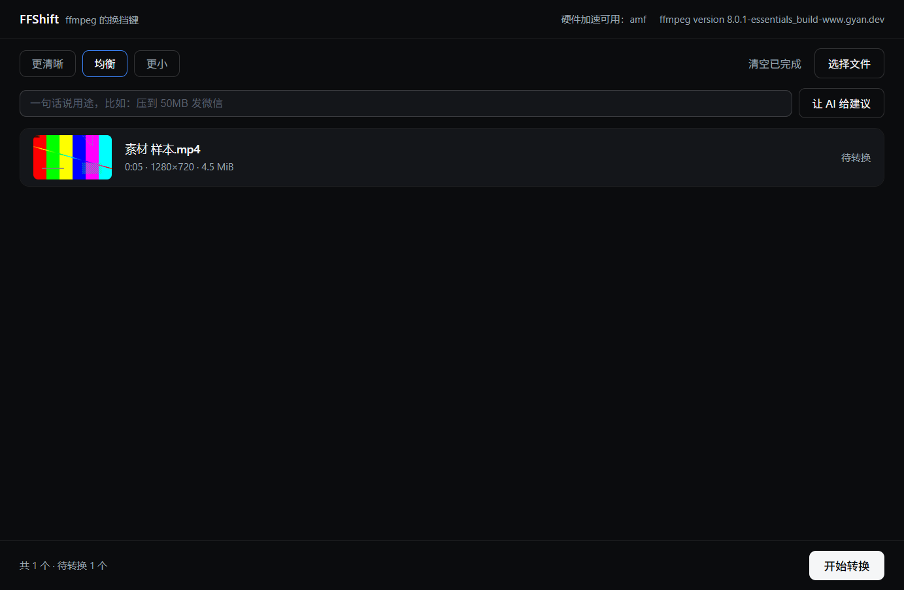

# FFShift

ffmpeg 的换挡键：不用懂参数，也能转好视频。

Windows 优先的桌面视频格式转换器。界面用 Electron + React + TypeScript，转换调用 ffmpeg 命令行，视频与密钥都留在本机。

## 界面



截图由 `FFSHIFT_SMOKE=shot` 自动生成：加载窗口、导入一个真实素材、等探测与缩略图落地后再拍，所以图和当前代码永远一致。

## 现在到什么程度

功能已经完整可用：导入探测、缩略图、三档转换、进度与取消、错误翻译、AI 参数建议、设置记忆、Windows 安装包。逐条状态见 `docs/testing.md` 的冒烟清单（未实测的条目如实标注）。

## 环境要求

| 项 | 版本 |
| --- | --- |
| Node.js | ≥ 20（开发环境实测 v22.23.2） |
| ffmpeg / ffprobe | 8.x（放 `resources/ffmpeg/`，不打进仓库） |
| git | 2.40+ |

## 上手

```bash
npm run hooks:install    # 装 git 钩子，新克隆仓库后运行一次
npm run hooks:verify     # 17 条钩子用例：拦截与放行都验一遍
npm run docs:sync        # 手动补跑一次文档沉淀
npm run docs:digest      # 查看 AI 沉淀草稿
npm run lint:commit      # 校验最近一次提交信息
```

## 开发流程

`main` 受保护，只能由功能分支经 PR 合并进来。分支名格式 `<前缀>/<模块>-<动作>`，例如 `feat/media-probe`。提交信息格式 `<area>: <祈使句>`，正文写清为什么改。

完整规则在 `docs/git-workflow.md`；钩子做什么、AI 在哪些环节参与，见 `docs/automation.md`。

## 文档

| 文件 | 内容 |
| --- | --- |
| `docs/architecture.md` | 方案与选型：竞品分析、技术栈对比、模块设计 |
| `docs/decisions.md` | 决策记录（ADR）：每条决策的备选、理由、代价、反馈 |
| `docs/git-workflow.md` | 分支模型、提交规范、仓库红线、版本与发布 |
| `docs/automation.md` | 钩子清单、文档沉淀范围、AI 使用边界 |
| `docs/testing.md` | 测试清单与执行记录 |
| `docs/writing-style.md` | 文案契约：禁词、句式、术语统一 |
| `docs/ai-session-log.md` | AI 协作会话记录 + 提交流水（自动追加） |
| `docs/project-status.md` | 项目状态页（自动生成，勿手改） |

## 规格

需求与规格放在 `openspec/`：`specs/` 记录系统当前必须满足的行为，`changes/` 存放尚未落地的提案。开发一个模块前先立提案，完成后归档。
